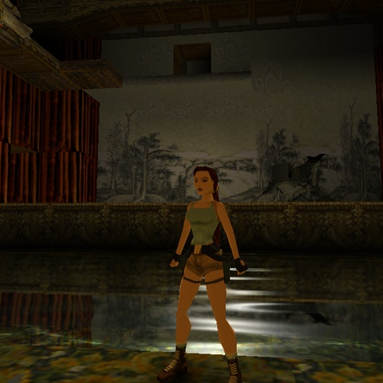
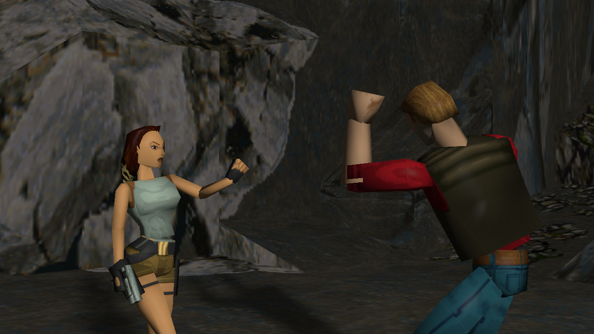
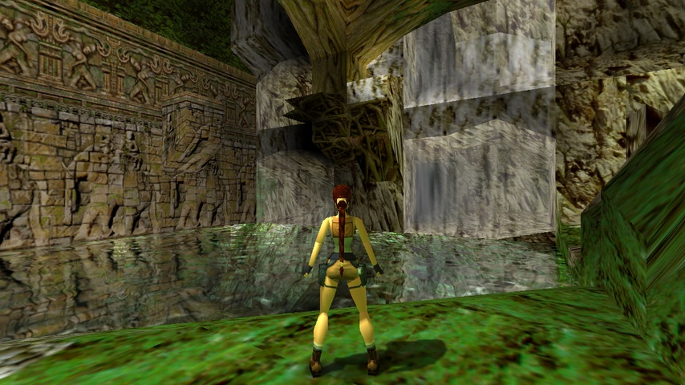
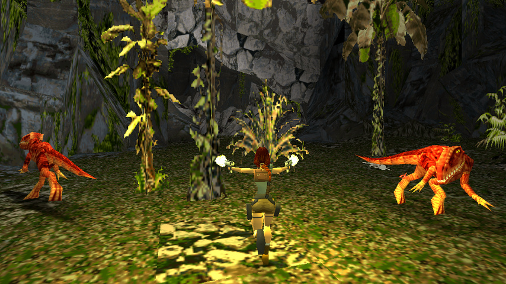

# Tomb Raider (OpenLara)

### Description

OpenLara is a Classic Tomb Raider open-source engine. It was inspired by the OpenTomb project.

### License

2-clause BSD

### Icon

### Fanart

Help make me fanart!

### Screenshots

